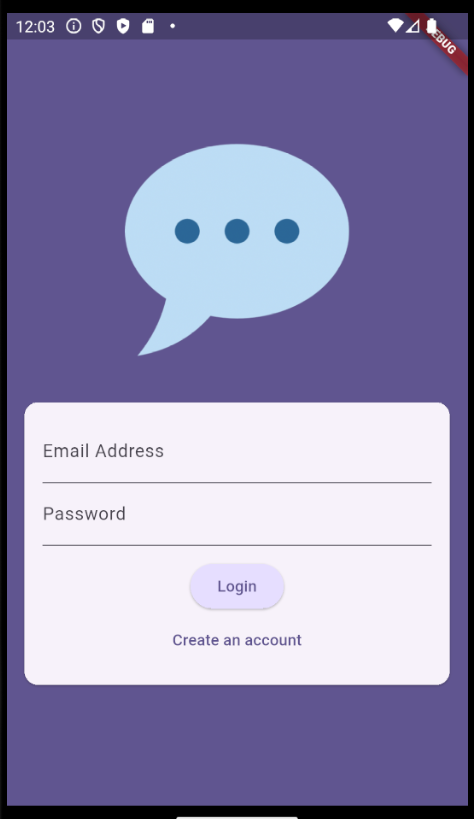
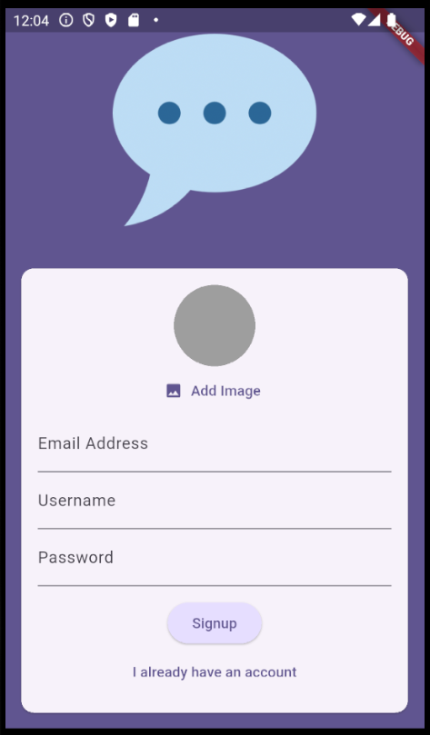

# FlutterChat

FlutterChat là một ứng dụng chat **realtime** đơn giản, hỗ trợ cả **Android** và **iOS**, sử dụng nền tảng **Firebase** để xử lý xác thực và lưu trữ dữ liệu, đồng thời sử dụng **Cloudinary** để lưu trữ ảnh đại diện người dùng.

## Tính năng chính

- Đăng ký và đăng nhập bằng Email
- Upload ảnh đại diện qua Cloudinary
- Chat realtime sử dụng Firebase Firestore
- UI đơn giản, dễ sử dụng

## Công nghệ sử dụng

- Flutter (Dart)
- Firebase Authentication
- Firebase Cloud Firestore
- Cloudinary (upload ảnh)
- Các package chính:
  - `firebase_auth`
  - `cloud_firestore`
  - `cloudinary_public`
  - `firebase_core`
  - `image_picker`

## Giao diện ứng dụng

| Đăng nhập | Đăng ký | Chat Screen |
|----------|----------|--------------|
|  |  |  |

## Hướng dẫn cài đặt & chạy app

1. **Clone repo:**

   ```bash
   git clone https://github.com/your-username/flutterchat.git
   cd flutterchat
   
2. **Cài đặt dependencies:**

   ```bash
   flutter pub get

3. **Cài đặt firebase:**

- Tạo project Firebase tại Firebase Console
- Thêm 2 app: Android & iOS.
- Cấu hình Firebase cho Flutter (iOS & Android) bằng FlutterFire CLI: [FlutterFire Setup Guide](https://firebase.google.com/docs/flutter/setup?hl=vi&platform=ios)
- Kích hoạt Authentication và Cloud Firestore.

## Quy trình hoạt động

1. **Màn hình đăng nhập / đăng ký:**

- Người dùng tiến hành đăng ký bằng email và mật khẩu.
- Sau khi đăng ký, người dùng được yêu cầu nhập username và chọn ảnh đại diện (upload lên Cloudinary).
- Nếu đã có tài khoản, người dùng có thể đăng nhập trực tiếp bang email va mật khẩu.

2. **Upload hình đại diện:**

- Người dùng chọn ảnh từ thiết bị thông qua image_picker.
- Ảnh được upload lên Cloudinary bằng cloudinary_public.
- Ứng dụng lưu URL ảnh trong Firestore gắn với tài khoản người dùng.

3. **Màn hình chat:**

- Sau khi đăng nhập thành công, người dùng được chuyển đến màn hình chat.
- Tin nhắn được gửi và nhận theo thời gian thực qua Firebase Cloud Firestore.
- Mỗi tin nhắn bao gồm:
  - Nội dung
  - Người gửi
  - Thời gian gửi
  - Avatar người gửi (hiển thị từ URL Cloudinary)

4. **Cập nhật realtime:**

- Ứng dụng sử dụng StreamBuilder để lắng nghe sự thay đổi trong Firestore.
- Tin nhắn mới được hiển thị ngay lập tức trên giao diện người dùng.


graph TD
    A[🧑 Mở ứng dụng] --> B{Đăng nhập hay Đăng ký?}
    B -- Đăng ký --> C[✍️ Nhập email + mật khẩu]
    C --> D[📤 Upload ảnh đại diện (Cloudinary)]
    D --> E[💬 Chuyển đến màn hình Chat]
    B -- Đăng nhập --> F[🔑 Nhập thông tin đăng nhập]
    F --> E
    E --> G{Gửi / nhận tin nhắn?}
    G -- Gửi --> H[📨 Gửi tin nhắn lên Firestore]
    G -- Nhận --> I[📥 Tin nhắn mới từ Firestore]
    H --> E
    I --> E
